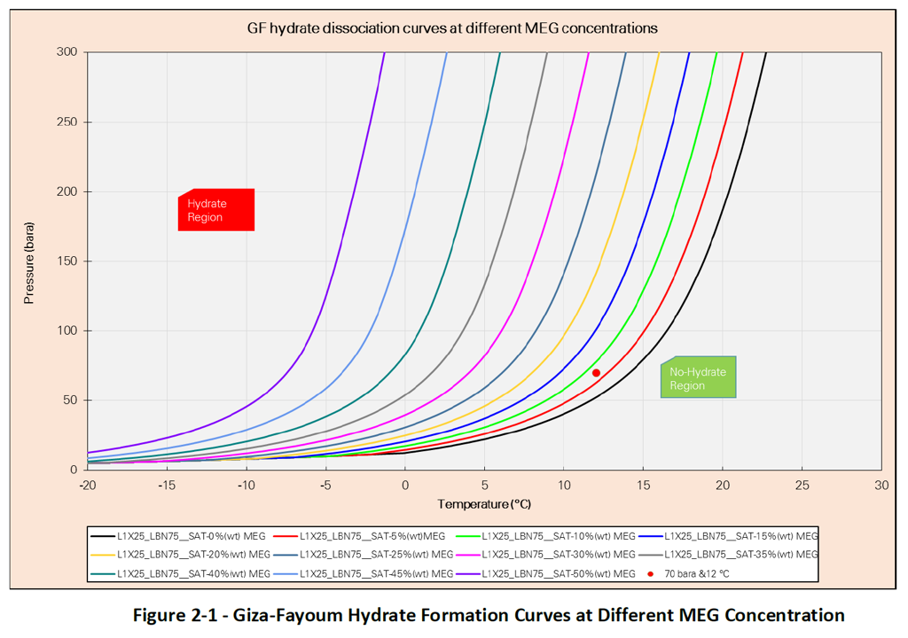

# MEG_Ryan
Investigating how oil field data might be used to reduce the use of Mono Ethylene Glycol – MEG

#Group Directions
There were two sub-groups within the team. They were looking at how to improve the control of MEG in a system so that its usage was lessened when conditions improved and they could shift more to the left on the graph below.

### Finding the right curve
This group looked at how you might find the right curve and spot on the curve to optimise the amount of MEG to use.

### Data modelling
This group looked at modelling the data in order to predict the right amount of MEG to use in given conditions.
